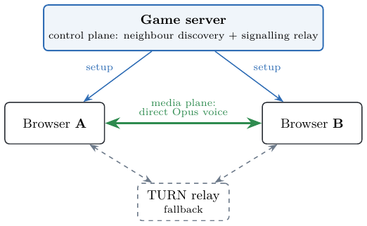
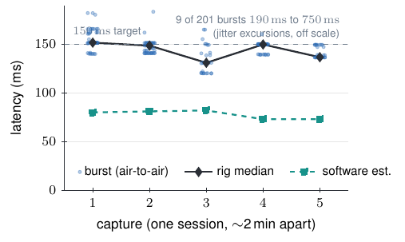
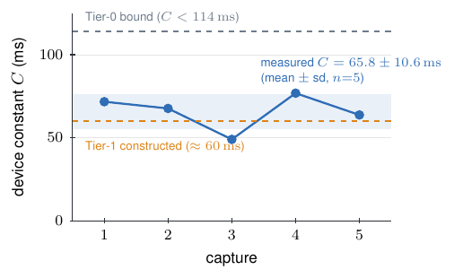

# PROX-VOICE

**"PROX-VOICE: A Proximity-Driven WebRTC Voice Mesh for Wireless Sensor Network Emulation in Browser-Based Virtual Environments"**.

PROX-VOICE treats a browser-based virtual world as a mobile ad-hoc network (MANET). Each client maintains direct peer-to-peer WebRTC audio links only to the neighbours within its proximity radius, forming a leaderless, self-organising voice mesh without a central media server. This repository contains the full implementation, the acoustic loopback measurement rig, the experiment harnesses, the raw telemetry collected during the measurement study, and the acoustic rig captures behind the calibrated-latency result.

<p align="center"></p>

---

## Repository layout

```
voice/              TypeScript mesh implementation
  VoiceRTC.ts       Peer model, ICE control, perfect negotiation, grace window, DTX
  vad.ts            Short-window RMS VAD with hysteresis
  VoiceMetrics.ts   Formation/ICE/glare lifecycle edges, latency sampler, KPI export
  VoiceChat.ts      In-browser Whisper worker, push-to-talk UI

rig/                Acoustic loopback latency rig (C++17)
  dsp.hpp           RBJ band-pass, envelope, decimation, NCC, percentile
  wav.hpp           RIFF PCM-16 reader/writer
  stimulus.cpp      Hann-windowed 2 kHz click-train generator
  synth_recording.cpp  Synthetic stereo recorder (known delay + noise)
  analyze.cpp       Cross-correlation analyzer, quality + minimum-lag gates, CSV + stats output
  Makefile          Build + self-test (synthesised 85 ms ground truth)
  tests/            node:test unit checks for DSP and WAV round-trip

experiments/        Node.js + Python measurement harnesses
  lib/
    wsn-client.cjs  Shared Playwright boot/login helpers
    tonegen.cjs     PCM-16 WAV generator (tone sweep, speech pattern)
  harness.cjs       N-client formation/KPI/uplink sweep
  mobility.cjs      Teardown/reconnect timing
  audiogap.cjs      Listener-perceived silence (packet-arrival detector)
  gracegap.cjs      Grace-window duty-cycle sweep
  dtxtest.cjs       DTX uplink measurement (tone vs speech, DTX on/off)
  sensing.cjs       Sensor suppression + report-kind profiling (idle/walk/conv/churn)
  ghostrepro.cjs    Latent bug 1 repro: SIGKILL ghost identity
  silentprobe.cjs   Latent bug 2 repro: formation-time silent-peer wedge classifier
  wedgetest.cjs     Latent bug 3 repro: +50-east teleport wedge
  audiodiag.cjs     Diagnostic: headless audio exchange correctness check
  rig-driver.cjs    Drives device A for the rig captures (login, peer wait,
                    capture, analyze, per-capture archive)
  RUNSHEET-rig.md   As-run rig procedure: wiring, phone protocol, gates
  compare-rig-runs.sh  Re-runs the analyzer on every archived capture, same gates
  baseline/         Server-mixed SFU baseline (werift + ws)
  aggregate.py      Consolidates data/ into the result tables
  data/             Raw experiment telemetry (134 JSON/JSONL files) + the five
                    acoustic rig captures (rig-rec-*.wav / rig-latency-*.csv)
```

---

## Prerequisites

| Component | Requirement |
|-----------|-------------|
| Rig (C++) | C++17 compiler (`c++` / `clang++` / `g++`) |
| Voice (TypeScript) | Node.js >= 18, `npm ci` |
| Harnesses | Node.js >= 18, Playwright-core (via the game client installation) |
| Aggregation | Python >= 3.9 |

---

## Measured result

<p align="center">


</p>

Five captures in one session, 201 click events kept: air-to-air mouth-to-ear latency 143.6 ± 9.2 ms (target < 150 ms), device constant C = 65.8 ± 10.6 ms — within one standard deviation of the constructed estimate. Both plots re-derive from the shipped captures:

```bash
cd rig && make && cd ../experiments && ./compare-rig-runs.sh
```

---

## Reproducing the results

### 1. Build and self-test the rig

```bash
cd rig
make check
```

`make check` synthesises a stereo recording with a known 85 ms injected delay, runs the analyzer, and verifies the recovered median is within one histogram bin. All unit tests run first via `make unit`.

### 2. Aggregate the measurement data

The raw telemetry is included in `experiments/data/`. Run:

```bash
python3 experiments/aggregate.py
```

This prints all seven result tables: formation/KPI sweep (Groups 1+2), mobility (Group 3), audio gap, sensing scenarios, real-network conditions, grace-window sweep, and DTX uplink.

### 3. Re-analyze the acoustic rig captures

```bash
cd rig && make          # build stimulus/analyze
cd ../experiments && ./compare-rig-runs.sh
```

Re-derives the mouth-to-ear latency statistics of every archived capture from
the raw two-channel audio in `data/`, using only the C++ rig — one line per
capture (kept bursts, median, p95, mean). Subtracting each capture's software
median (in the driver log and the report) yields the device constant `C`.

### 4. Re-running the harnesses

The experiment harnesses require a running game server and browser client (not included in this repository). Two environment variables must be set:

| Variable | Purpose |
|----------|---------|
| `TS_CLIENT` | Path to the browser client installation root; must contain `node_modules/playwright-core` |
| `BASE_URL` | Game server URL (default `http://127.0.0.1:5001`) |

The harnesses drive the browser client via Playwright and read results from the JavaScript globals the client exposes at runtime:

| Global | Used for |
|--------|---------|
| `wsnGame.loggedIn()` | Login completion check |
| `wsnVoice.kpis()` | Voice mesh KPI export |
| `wsnVoiceCtl.rxAudio()` | Inbound-RTP probe: packets, emitted samples, audio level |
| `wsnVoiceCtl.peerIndices()` | Server indices of connected voice peers |
| `wsnVoice.setCalibrationMs(C)` | Applies the rig-measured device constant |
| `wsnVoiceCtl.grace?.()` | Grace-window accessor |
| `wsnVoiceCtl.linkDebug()` | Per-link debug state |
| `wsnSense.stats()` | Sensor suppression stats |
| `wsnSense.links` | Sensor link readings |
| `wsnSense.kindCounts?.()` | Report-kind histogram |
| `wsnEnergy.total()` | Virtual energy debit total |

URL parameters recognised by the client: `?wsndtx=0|1` (Opus DTX), `?wsngrace=<ms>` (grace window duration), `?wsncond=<tag>` (real-network condition label).

Individual harnesses are invoked as:

```bash
node experiments/harness.cjs <N> [holdSec]
node experiments/mobility.cjs [tiles] [holdSec]
node experiments/audiogap.cjs [absenceSec]
node experiments/gracegap.cjs <graceMs> [absenceSec]
node experiments/dtxtest.cjs <tone|speech> <0|1>
node experiments/sensing.cjs <idle|walk|conv|churn>
```

The baseline SFU requires `npm install` inside `experiments/baseline/` before first use.

---

## License

MIT — see [LICENSE](LICENSE).
